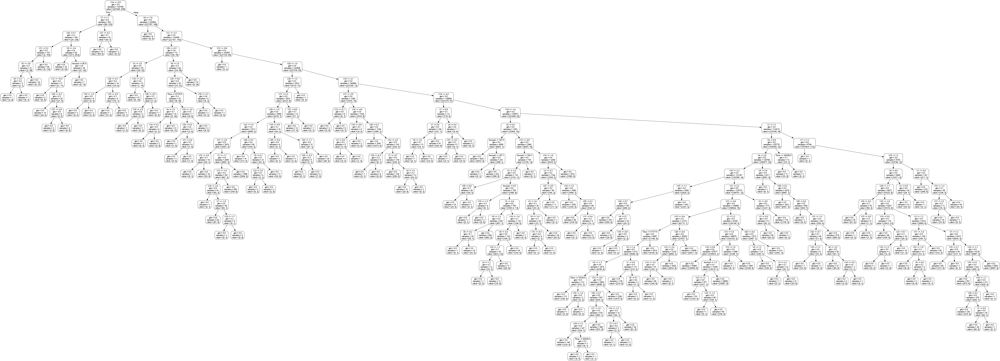

# 💳 Credit Card Fraud Detection using Random Forest

[](https://www.python.org/)
[](https://scikit-learn.org/)
[](https://pandas.pydata.org/)
[](LICENSE)

An end-to-end machine learning project for detecting fraudulent credit card transactions using a **Random Forest Classifier**.

The project focuses on binary classification of **normal vs. fraudulent transactions** and evaluates the model using **accuracy, precision, recall, F1-score, and a confusion matrix**. Because fraud detection is highly imbalanced, particular attention is given to the minority fraud class, where missed fraud cases can be more important than overall accuracy.

---

## 📌 Project Overview

Credit card fraud detection is a highly imbalanced classification problem: legitimate transactions greatly outnumber fraudulent transactions. Because of this imbalance, a model can achieve high overall accuracy while still missing important fraud cases.

This project builds a Random Forest-based classification pipeline that:

- Loads and explores transaction data
- Separates features from the `Class` target
- Splits the data into training and testing sets
- Trains a Random Forest classifier
- Generates predictions on unseen test data
- Evaluates the classifier using multiple classification metrics
- Visualizes the confusion matrix
- Exports a decision tree from the Random Forest for interpretability
- Saves the trained Random Forest model as a `.pkl` file

The notebook contains several model-training and evaluation experiments. The final saved model is trained using:

```text
n_estimators = 225
random_state = 42
n_jobs = -1
```

---

## 🎯 Objectives

- Detect fraudulent credit card transactions
- Build a reproducible Random Forest classification workflow
- Evaluate performance beyond accuracy because the dataset is highly imbalanced
- Analyze false positives and false negatives using a confusion matrix
- Save the trained model so it can be reused without retraining
- Visualize one decision tree from the trained ensemble

---

## 📊 Dataset

The notebook loads the dataset from:

```text
creditcard.csv
```

The dataset used in the notebook contains:

| Property | Details |
|---|---|
| **Transactions** | 284,807 |
| **Columns** | 31 |
| **Features** | `Time`, `V1`–`V28`, `Amount` |
| **Target** | `Class` |

The `V1`–`V28` features are PCA-transformed features used in the dataset to protect user identities and sensitive information.

### Target Variable

| Class | Meaning |
|---:|---|
| `0` | Normal transaction |
| `1` | Fraudulent transaction |

The target is highly imbalanced, which is why **precision, recall, and F1-score** are included alongside accuracy.

---

## 🧠 Machine Learning Model

### Random Forest Classifier

The main model is a **Random Forest Classifier**, an ensemble learning algorithm that combines multiple decision trees to make classification decisions.

The final saved model uses:

```python
RandomForestClassifier(
    n_estimators=225,
    random_state=42,
    n_jobs=-1
)
```

The notebook also contains earlier experiments using different Random Forest configurations, including 100 trees, 50 trees, and the default number of estimators.

### Why Random Forest?

Random Forest is useful for this project because it:

- Combines multiple decision trees
- Can model nonlinear relationships
- Handles many numerical features effectively
- Reduces the variance associated with an individual decision tree
- Provides access to individual trees for visualization and inspection

---

## 🔄 Machine Learning Pipeline

```text
Credit Card Transaction Dataset
            │
            ▼
      Data Loading
            │
            ▼
    Data Exploration
            │
            ▼
 Feature / Target Separation
            │
            ▼
  Train / Test Split (80/20)
            │
            ▼
   Random Forest Training
            │
            ▼
       Predictions
            │
            ▼
 ┌───────────────────────────┐
 │ Model Evaluation          │
 │ • Accuracy                │
 │ • Precision               │
 │ • Recall                  │
 │ • F1-Score                │
 │ • Confusion Matrix        │
 └───────────────────────────┘
            │
            ▼
 Decision Tree Visualization
            │
            ▼
    Save Trained Model
```

---

## ⚙️ Data Preparation

### 1. Load the Dataset

```python
data = pd.read_csv("creditcard.csv")
```

### 2. Verify the Target Column

The notebook checks that the `Class` column exists.

### 3. Separate Features and Target

```python
X = data.drop(columns=["Class"])
y = data["Class"]
```

All columns except `Class` are used as model features.

### 4. Train-Test Split

The final training workflow uses an 80/20 split with stratification:

```python
X_train, X_test, y_train, y_test = train_test_split(
    X,
    y,
    test_size=0.2,
    random_state=42,
    stratify=y
)
```

Using `stratify=y` helps preserve the class distribution between the training and testing sets.

---

## 📈 Model Evaluation

The notebook evaluates the Random Forest using the following metrics.

### Accuracy

Measures the proportion of all predictions that are correct.

### Precision

Measures how many transactions predicted as fraud are actually fraudulent.

### Recall

Measures how many of the actual fraudulent transactions are successfully detected.

For fraud detection, **recall is particularly important** because a false negative means a fraudulent transaction was classified as normal.

### F1-Score

The harmonic mean of precision and recall, providing a single measure that balances both.

### Confusion Matrix

The notebook also generates a confusion matrix to visualize:

- True Negatives
- False Positives
- False Negatives
- True Positives

The notebook contains the code for calculating these metrics, but the saved notebook does not retain the final printed numeric metric output in its stored cell outputs. Therefore, this README intentionally does **not** claim unsupported accuracy, precision, recall, or F1-score values.

---

## 🌳 Random Forest Tree Visualization

One decision tree from the trained Random Forest is exported using Graphviz:

```python
tree = random_forest_model.estimators_[5]

export_graphviz(
    tree,
    out_file="tree.dot",
    feature_names=feature_list,
    rounded=True,
    precision=1
)
```

The generated DOT file is then converted into a PNG visualization:

```text
tree.dot
random_forest_tree.png
```

This provides a visual look at how an individual tree in the ensemble makes split decisions using features such as `V1`–`V28`, `Time`, and `Amount`.

### Visualization



---

## 💾 Saved Model

The trained Random Forest is saved using Joblib:

```python
joblib.dump(
    random_forest_model,
    "random_forest_model.pkl"
)
```

The repository therefore contains:

```text
random_forest_model.pkl
```

The notebook also demonstrates loading the saved model with Python's `pickle` module.

---

## 🗂️ Project Structure

```text
fraud-detection-ml/
│
├── cc_output.ipynb
├── creditcard.csv
├── random_forest_model.pkl
├── random_forest_tree.png
├── tree.dot
├── README.md
├── LICENSE
├── .gitignore
└── .gitattributes
```

### File Description

| File | Description |
|---|---|
| `cc_output.ipynb` | Complete Jupyter Notebook containing data exploration, model training, evaluation, and visualization |
| `creditcard.csv` | Credit card transaction dataset tracked using Git LFS |
| `random_forest_model.pkl` | Serialized trained Random Forest model |
| `random_forest_tree.png` | PNG visualization of one decision tree from the forest |
| `tree.dot` | Graphviz representation of the exported decision tree |
| `README.md` | Project documentation |
| `LICENSE` | Project license |
| `.gitignore` | Files excluded from Git tracking |
| `.gitattributes` | Git attributes configuration |

---

## 🛠️ Technologies Used

### Programming Language

- Python

### Data Processing

- Pandas
- NumPy

### Machine Learning

- Scikit-learn
- Random Forest Classifier

### Visualization

- Matplotlib
- Seaborn
- Graphviz / Pydot

### Model Persistence

- Joblib
- Pickle

### Development Environment

- Jupyter Notebook / JupyterLab
- Kaggle Notebook environment was referenced in the original notebook

---

## 📦 Installation

### 1. Clone the Repository

```bash
git clone https://github.com/sham12karthik/fraud-detection-ml.git
cd fraud-detection-ml
```

### 2. Create a Virtual Environment

```bash
python -m venv .venv
```

### 3. Activate the Environment

On macOS/Linux:

```bash
source .venv/bin/activate
```

### 4. Install the Python Dependencies

```bash
pip install numpy pandas scikit-learn matplotlib seaborn joblib pydot
```

For decision-tree PNG generation, a working Graphviz installation may also be required.

On macOS with Homebrew:

```bash
brew install graphviz
```

---

## ▶️ How to Run

1. Clone the repository.
2. Install the required dependencies.
3. Make sure the dataset is available as `creditcard.csv`.
4. Open:

```text
cc_output.ipynb
```

5. Run the notebook cells from top to bottom.

### Local Path Note

Some original notebook cells contain Windows-specific absolute paths such as:

```text
C:\Local disk (D)\Project Pinnacle\...
```

When running the project locally on another machine, change those paths to the location of the cloned repository and dataset.

For example:

```python
data = pd.read_csv("creditcard.csv")
```

---

## 🔍 Key Implementation Details

### Feature / Target Definition

```python
X = data.drop(columns=["Class"])
y = data["Class"]
```

### Stratified Train-Test Split

```python
train_test_split(
    X,
    y,
    test_size=0.2,
    random_state=42,
    stratify=y
)
```

### Final Random Forest

```python
RandomForestClassifier(
    n_estimators=225,
    random_state=42,
    n_jobs=-1
)
```

### Save Model

```python
joblib.dump(
    random_forest_model,
    "random_forest_model.pkl"
)
```

---

## ⚠️ Important Note About the Dataset

The repository's `creditcard.csv` is tracked using **Git LFS** rather than storing the full large dataset directly in the normal Git history.

If the dataset is not downloaded after cloning, install Git LFS and pull the tracked files:

```bash
git lfs install
git lfs pull
```

The notebook reports the dataset as:

```text
284,807 rows × 31 columns
```

---

## 🚧 Limitations & Future Improvements

Possible improvements to make the project more production-ready include:

- Hyperparameter tuning using `GridSearchCV` or `RandomizedSearchCV`
- More systematic handling of class imbalance
- Threshold tuning to prioritize fraud recall
- Comparison with Logistic Regression, XGBoost, LightGBM, or other classifiers
- Cross-validation for more robust model evaluation
- Feature-importance analysis
- SHAP-based model interpretability
- A prediction API using Flask or FastAPI
- A Streamlit dashboard for interactive fraud prediction
- Model monitoring and drift detection for real-world deployment
- A reproducible `requirements.txt` or `pyproject.toml`

---

## 💡 Why This Project Matters

Fraud detection is not simply an accuracy problem.

In a highly imbalanced dataset, a model can appear highly accurate while failing to detect a meaningful portion of fraudulent transactions.

This project therefore evaluates the classifier using:

- Accuracy
- Precision
- Recall
- F1-score
- Confusion matrix

This provides a more useful view of the model's fraud-detection behavior than accuracy alone.

---

## 📚 Learning Outcomes

Through this project, the following concepts were practiced:

- Exploratory Data Analysis
- Handling an imbalanced binary classification problem
- Feature and target separation
- Train-test splitting
- Stratified sampling
- Random Forest classification
- Model evaluation
- Precision vs. recall trade-offs
- Confusion matrix analysis
- Decision-tree visualization
- Model serialization with Joblib
- Loading a saved machine learning model
- Git and GitHub project management

---

## 👨‍💻 Author

### Sham Karthik

GitHub: [@sham12karthik](https://github.com/sham12karthik)

---

## 📄 License

This project is distributed under the license included in the repository.

---

## ⭐ Support

If you find this project useful or interesting, consider giving the repository a ⭐ on GitHub.
